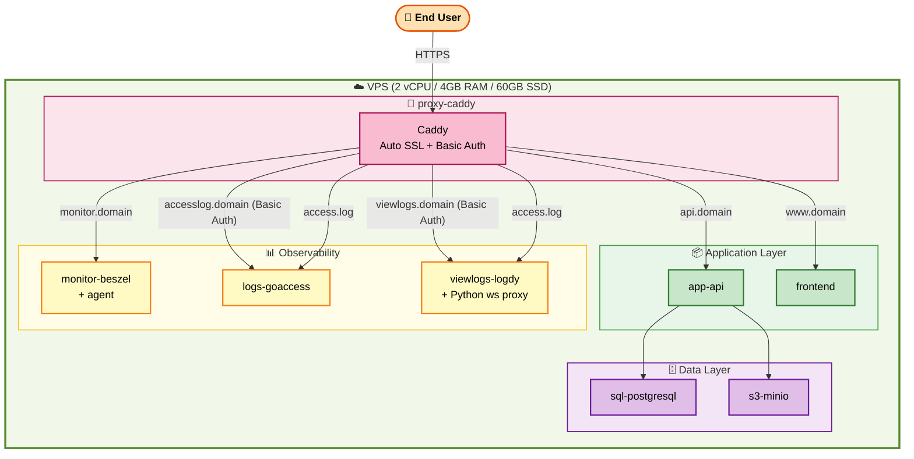
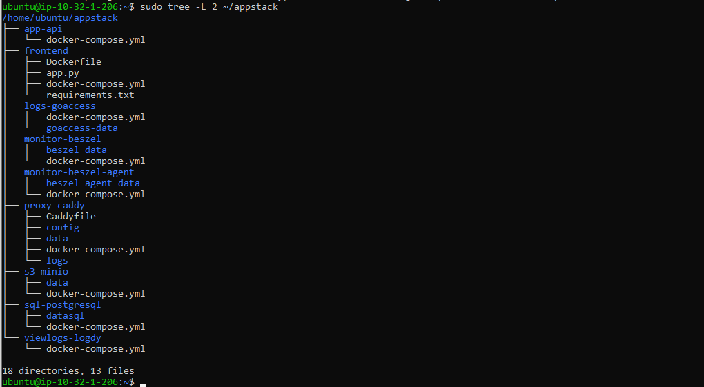
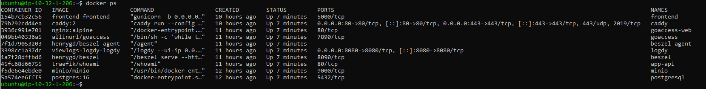
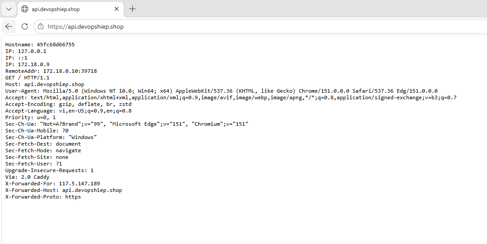
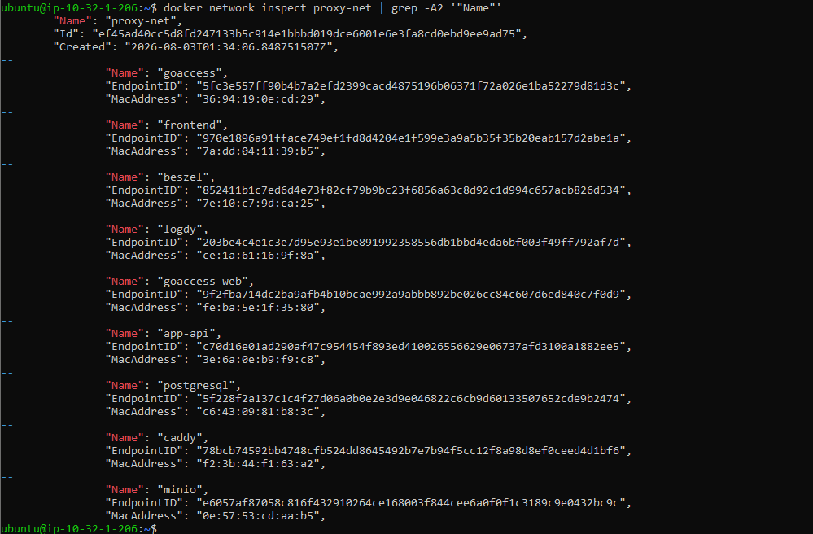
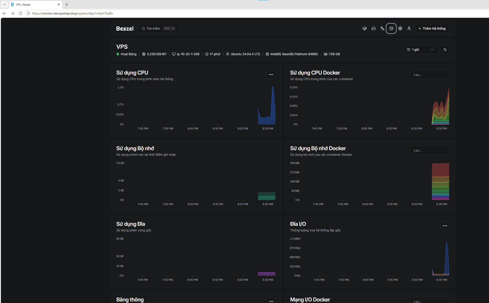
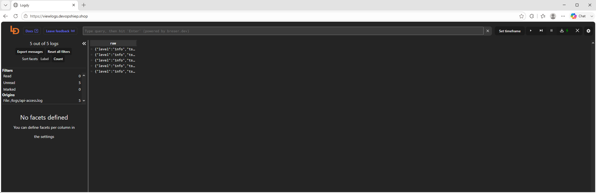
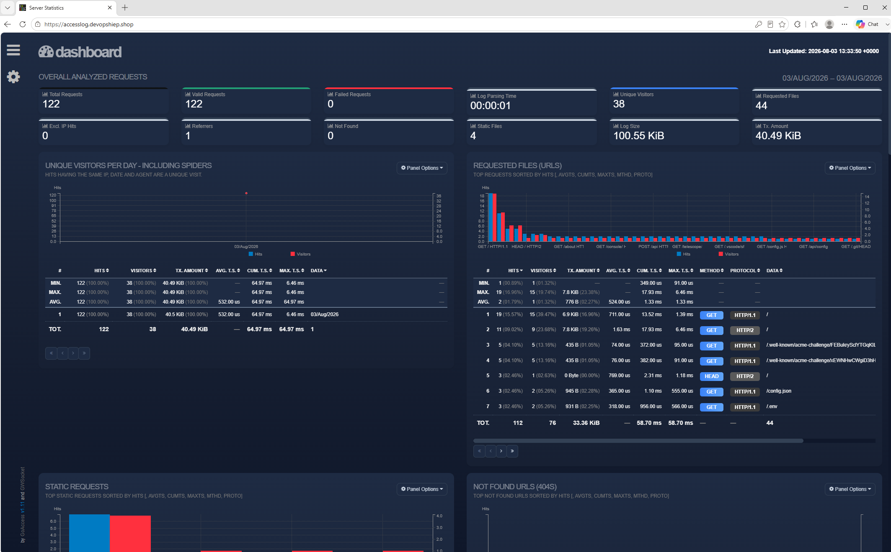
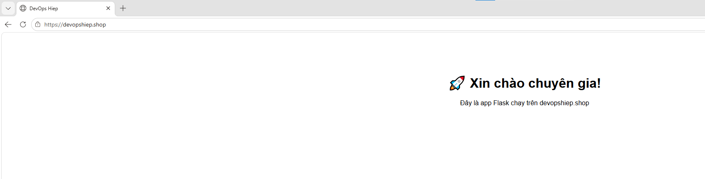
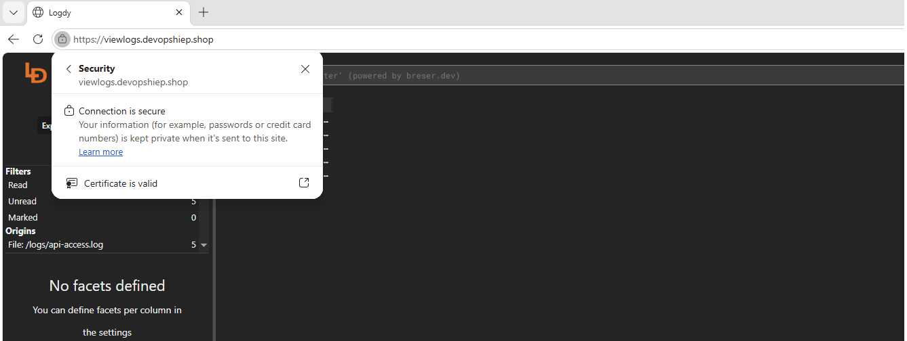

# 🚀 Small VPS App Stack: Docker Compose + Caddy Reverse Proxy with Automated SSL, Monitoring & Log Analytics

[](https://aws.amazon.com/)
[](https://ubuntu.com/)
[](https://www.docker.com/)
[](https://caddyserver.com/)
[](https://www.postgresql.org/)
[](https://min.io/)
[](https://beszel.dev/)
[](https://goaccess.io/)
[](https://logdy.dev/)
[](https://www.python.org/)

<details>
<summary><strong>📑 Table of Contents (Click to expand)</strong></summary>

- 📌 [Introduction](#introduction)
- 🚀 [Key Features](#key-features)
- 🏗️ [Architecture Overview](#architecture-overview)
- 📁 [Project Structure](#project-structure)
- 🛠️ [Technologies Used](#technologies-used)
- ☁️ [VPS Infrastructure](#vps-infrastructure)
- 💻 [Quick Start](#quick-start)
- ✅ [1. Directory & Network Setup](#step-1)
- 🔐 [2. Caddy Reverse Proxy + Automated SSL](#step-2)
- 🗄️ [3. Backing Services (PostgreSQL & MinIO)](#step-3)
- 📈 [4. Monitoring with Beszel](#step-4)
- 📜 [5. Real-time Log Viewing with Logdy](#step-5)
- 📊 [6. Access Log Analytics with GoAccess](#step-6)
- 🌐 [7. Live Application Demo](#step-7)
- ⚠️ [Troubleshooting & Lessons Learned](#troubleshooting-lessons-learned)
- 🔮 [Production Gaps & Future Improvements](#future-production-improvements)
- 👤 [Author](#author)

</details>

---

<h2 id="introduction">📌 Introduction</h2>

This repository documents a complete small-scale application deployment on a single **VPS (2 vCPU / 4GB RAM / 60GB SSD)**, built entirely with **Docker Compose** — one independent `docker-compose.yml` per service, all connected through a shared Docker network and fronted by **Caddy** as a reverse proxy with fully automated **Let's Encrypt SSL**.

The stack separates application containers (API, Frontend) from infrastructure containers (Proxy, Database, Object Storage, Monitoring, Logging), mirroring a production-style microservices layout while staying lightweight enough to run comfortably on a small VPS.

> **Note:** The VPS used for this deployment has since been decommissioned to avoid ongoing hosting costs. All domains referenced below are no longer live — screenshots throughout this README were captured while the stack was running and serve as evidence of a working deployment.

Beyond the happy path, this project documents several **real infrastructure incidents** encountered during deployment — a Let's Encrypt rate-limit lockout, a WebSocket "Mixed Content" bug behind HTTPS, and a Docker entrypoint conflict — each diagnosed and resolved from raw container logs.

---

<h2 id="key-features">🚀 Key Features</h2>

* 🏗️ **Per-Service Isolation**: 9 independent services (App API, Frontend, PostgreSQL, MinIO, Caddy, Beszel + Agent, GoAccess, Logdy), each with its own `docker-compose.yml`, joined through a single shared external Docker network (`proxy-net`).
* 🔐 **Automated HTTPS**: Caddy automatically provisions and renews Let's Encrypt certificates for 5 subdomains — zero manual certificate management.
* 🔑 **Basic Auth on Demand**: Services without built-in authentication (log viewer, log analytics) are protected via Caddy's `basic_auth`, generated with `caddy hash-password`.
* 📈 **Real-time System Monitoring**: Beszel + Beszel Agent track CPU, memory, disk, and per-container Docker resource usage live.
* 📜 **Live Log Streaming**: Logdy tails Caddy's access logs over WebSocket for real-time viewing in the browser.
* 📊 **Access Analytics Dashboard**: GoAccess parses Caddy access logs into a full traffic dashboard (unique visitors, top requested files, static assets, 404s).
* 🐍 **Custom Python Reverse Proxy**: A hand-written `aiohttp`-based proxy patches a known Logdy front-end bug (hardcoded `ws://` breaking under HTTPS) by rewriting response bodies and transparently forwarding WebSocket frames.
* 🧹 **Bounded Container Logs**: Docker's `json-file` log driver is capped (`max-size`, `max-file`) system-wide via `/etc/docker/daemon.json` to prevent disk exhaustion.

---

<h2 id="architecture-overview">🏗️ Architecture Overview</h2>



---

<h2 id="project-structure">📁 Project Structure</h2>

```text
appstack/
├── app-api/
│   └── docker-compose.yml              # Backend API container
├── frontend/
│   ├── Dockerfile                      # Python (Flask) build
│   ├── app.py
│   ├── requirements.txt
│   └── docker-compose.yml
├── logs-goaccess/
│   ├── docker-compose.yml              # GoAccess + static report generation
│   └── goaccess-data/                  # Generated index.html report
├── monitor-beszel/
│   ├── docker-compose.yml              # Beszel hub
│   └── beszel_data/
├── monitor-beszel-agent/
│   ├── docker-compose.yml              # Beszel agent (host metrics + Docker)
│   └── beszel_agent_data/
├── proxy-caddy/
│   ├── Caddyfile                       # Reverse proxy rules + Basic Auth
│   ├── docker-compose.yml
│   ├── config/ data/                   # Caddy-managed TLS state
│   └── logs/                           # Per-domain access logs
├── s3-minio/
│   ├── docker-compose.yml              # S3-compatible object storage
│   └── data/
├── sql-postgresql/
│   ├── docker-compose.yml              # PostgreSQL database
│   └── datasql/
└── viewlogs-logdy/
    ├── docker-compose.yml              # Logdy + Python aiohttp ws-fix proxy
    ├── app.py                          # Custom reverse proxy (HTTP + WS)
    ├── Dockerfile
    └── requirements.txt
```

---

<h2 id="technologies-used">🛠️ Technologies Used</h2>

| Component | Technology / Badge | Description |
|---|---|---|
| **Cloud Provider** |  | EC2 instance hosting the entire stack |
| **Hosting** |  | Single small VPS (2 vCPU / 4GB RAM / 60GB SSD) |
| **Containerization** |  | 9 independently composed services on a shared network |
| **Reverse Proxy / TLS** |  | Automatic Let's Encrypt certificates, Basic Auth, per-domain access logs |
| **Database** |  | Primary relational data store |
| **Object Storage** |  | S3-compatible storage for the app |
| **Monitoring** |  | Real-time CPU / RAM / disk / Docker container metrics |
| **Log Analytics** |  | Static + periodic HTML traffic reports from Caddy access logs |
| **Log Streaming** |  | Real-time browser log tailing over WebSocket |
| **Custom Tooling** |  | Hand-written HTTP + WebSocket reverse proxy to patch a Logdy front-end bug |

---

<h2 id="vps-infrastructure">☁️ VPS Infrastructure</h2>

| Domain (example) | Service | Auth |
|---|---|---|
| `api.yourdomain.com` | app-api | — |
| `www.yourdomain.com` | frontend (Python/Flask) | — |
| `monitor.yourdomain.com` | Beszel dashboard | Beszel account |
| `viewlogs.yourdomain.com` | Logdy (real-time log tail) | Basic Auth |
| `accesslog.yourdomain.com` | GoAccess dashboard | Basic Auth |

DNS: 5 `A` records point directly at the VPS public IP. Caddy handles certificate issuance per-domain automatically on first request. *(This lab's VPS has since been torn down — see the screenshots below for evidence of the working deployment.)*

---

<h2 id="quick-start">💻 Quick Start</h2>

### Prerequisites
* A VPS with a public IP and root/sudo access
* Docker & Docker Compose installed
* A domain with DNS access

### Step 1: Provision & Harden Docker
```bash
curl -fsSL https://get.docker.com | sh
sudo tee /etc/docker/daemon.json <<'EOF'
{ "log-driver": "json-file", "log-opts": { "max-size": "10m", "max-file": "3" } }
EOF
sudo systemctl restart docker
docker network create proxy-net
```

### Step 2: Point DNS
Create 5 `A` records (`api`, `www`, `monitor`, `viewlogs`, `accesslog`) pointing to the VPS public IP.

### Step 3: Start Every Service
```bash
for d in sql-postgresql s3-minio app-api frontend monitor-beszel monitor-beszel-agent logs-goaccess viewlogs-logdy proxy-caddy; do
  (cd appstack/$d && docker compose up -d)
done
```
> `proxy-caddy` is started last so it can resolve every upstream container by name over `proxy-net`.

---

<h2 id="step-1">✅ 1. Directory & Network Setup</h2>

Every service lives in its own directory with an isolated `docker-compose.yml`, joined through a single shared external network:




<h2 id="step-2">🔐 2. Caddy Reverse Proxy + Automated SSL</h2>

Caddy terminates TLS for every subdomain and forwards requests to the matching container by name over the internal network:



<h2 id="step-3">🗄️ 3. Backing Services (PostgreSQL & MinIO)</h2>

PostgreSQL and MinIO run as isolated containers on the internal network, not directly exposed to the internet. All 9 services communicate over a single shared Docker network:



<h2 id="step-4">📈 4. Monitoring with Beszel</h2>

Beszel Agent reports live CPU, memory, disk, and per-container Docker metrics to the Beszel hub:



<h2 id="step-5">📜 5. Real-time Log Viewing with Logdy</h2>

A custom Python (`aiohttp`) reverse proxy sits in front of Logdy to fix a front-end bug where WebSocket connections were hardcoded to `ws://`, breaking under HTTPS ("Mixed Content"). The proxy rewrites `ws://` → `wss://` in served JS and transparently forwards WebSocket frames both ways:



<h2 id="step-6">📊 6. Access Log Analytics with GoAccess</h2>

GoAccess periodically re-parses Caddy's access logs into a static HTML dashboard, served by a lightweight Nginx sidecar:



<h2 id="step-7">🌐 7. Live Application Demo</h2>

Frontend (Python/Flask) and API both served over HTTPS through Caddy, with valid Let's Encrypt certificates:




---

<h2 id="troubleshooting-lessons-learned">⚠️ Troubleshooting & Lessons Learned</h2>

Real incidents encountered and resolved during deployment:

| # | Issue | Root Cause | Fix |
|---|---|---|---|
| 1 | `monitor.*` domain stuck returning TLS handshake errors | Let's Encrypt's "too many failed authorizations" rate limit was triggered by repeated cert requests issued before DNS had fully propagated | Stopped manually restarting Caddy (each restart counted as a new failed attempt); let Caddy's built-in exponential backoff retry on its own until the 1-hour window expired |
| 2 | `goaccess` container exited immediately: `Unable to open the specified log file 'goaccess'` | The image's `ENTRYPOINT` already invokes `goaccess`; the Compose `command` also started with the word `goaccess`, which the binary parsed as its log-file argument | Removed the duplicate `goaccess` token from `command` |
| 3 | `logdy` container failed to pull: `repository does not exist` | `logdyhq/logdy-core` has no published Docker Hub image | Switched to `build: { context: <github repo>.git }` to build the image from source |
| 4 | Multi-line YAML `command:` caused `/bin/sh: -o: not found` | Folded YAML block scalars didn't collapse as expected once pasted through a terminal editor, leaving each flag on its own shell line | Rewrote the command as a single-line JSON array (`["while true; do ...; done"]`) to remove ambiguity |
| 5 | `accesslog.*` returned `HTTP 502` after switching GoAccess to static-report mode | Caddyfile was still pointed at the old real-time WebSocket container (`goaccess:7880`) instead of the new static-file Nginx sidecar (`goaccess-web:80`) | Updated `reverse_proxy` target in the Caddyfile and restarted Caddy |
| 6 | Logdy UI loaded but showed `Status: Not connected` | Logdy's front-end JavaScript hardcodes `ws://` regardless of page protocol — browsers block this as Mixed Content when the page is served over HTTPS (known upstream issue) | Introduced a small reverse proxy (initially Nginx `sub_filter`, later rewritten in Python/`aiohttp`) that rewrites `ws://` → `wss://` in served responses and proxies the WebSocket connection itself |
| 7 | Basic Auth login kept failing despite "correct" password | The literal placeholder text used in the example `caddy hash-password --plaintext 'PlaceholderText'` command had been run as-is — the *placeholder itself* became the real password, not a value the user was meant to substitute first | Confirmed via `curl -u` round-trip testing; documented clearly which string was the actual literal password before rotating to a real one |
| 8 | `docker exec caddy wget ... : No such container: caddy` | The `proxy-caddy` compose stack had been validated/formatted but never actually started (`docker compose up -d`) | Ran `docker compose up -d` in `proxy-caddy` before testing container-to-container connectivity |

<h2 id="future-production-improvements">🔮 Production Gaps & Future Improvements</h2>

While functional for a small deployment, this setup has known limitations. Recommended improvements for production:
1. **Secrets Management:** Move plaintext DB/MinIO credentials out of `docker-compose.yml` into an `.env` file (git-ignored) or a secrets manager.
2. **Resource Limits:** Add explicit `cpus` / `mem_limit` constraints per service to prevent any single container from starving the others on a small VPS.
3. **Backups:** Automate periodic `pg_dump` and MinIO bucket snapshots to off-host storage.
4. **Upstream Fix Tracking:** Remove the custom Logdy WebSocket-patch proxy once the upstream `ws://` hardcoding bug is fixed and merged.
5. **Centralized Orchestration:** Introduce `start-all.sh` / `stop-all.sh` (or a top-level Compose override) to manage dependency ordering across all 9 services from a single command.

<h2 id="author">👤 Author</h2>

**Minh Hiep**

* **GitHub**: [@minhhiep05](https://github.com/minhhiep05)
